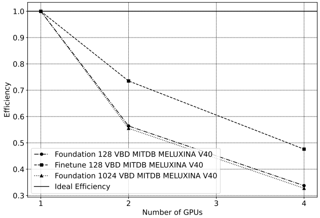
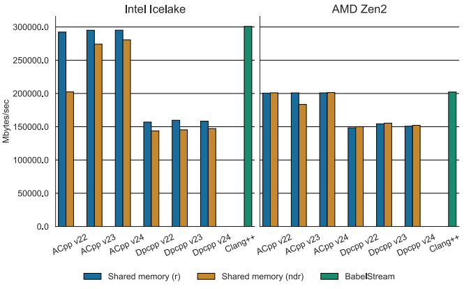
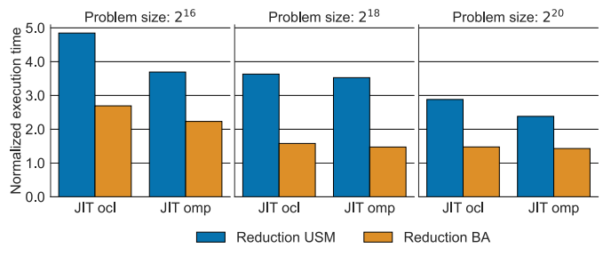
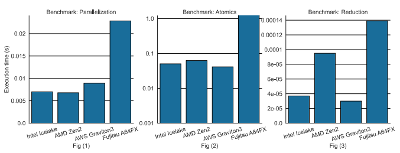
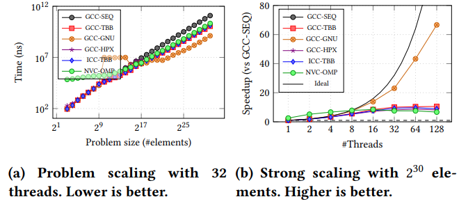
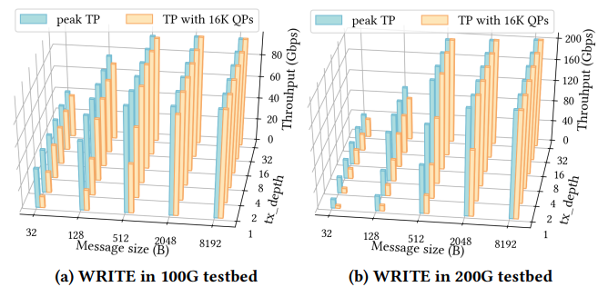
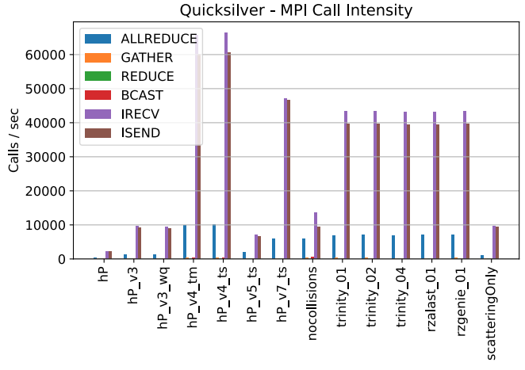
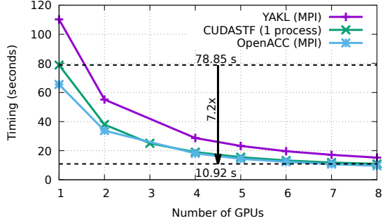
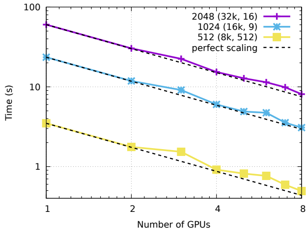
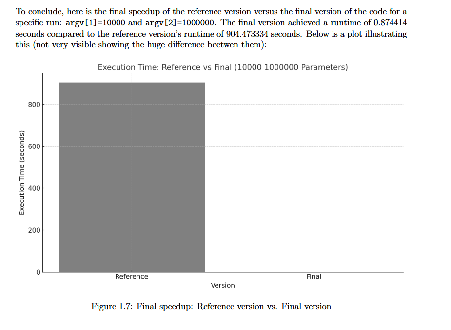

# Methodology for measuring and visualizing performance metrics

An overview of performance metrics used in HPC, and how to correctly visualize them.

## Scalability

In the most general sense, **scalability** (or **scaling**) is defined as "_the ability to handle more work as the amount of computing resources grows_". For software, scalability is sometimes referred to as parallelization
efficiency — the ratio between the actual speedup and the ideal speedup obtained when using a certain number of
processors. The speedup in parallel computing can be straightforwardly defined as:

$$
Speedup = \frac{t_1}{t_N}
$$

Where $t_1$ is the computational time for running the software with one core (i.e. sequentially), and $t_N$ is the
computational time running the same software with N cores or processors. Ideally, we want software to have a linear
speedup that is equal to the number of processors (i.e. $Speedup = N$). Unfortunately, this is a very challenging goal
for real world applications to attain (see [Amdhal's Law](https://en.wikipedia.org/wiki/Amdahl's_law)).

Scalability testing measures the ability of an application to perform well or better with varying problem sizes and
numbers of processors. It does not test the applications general funcionality or correctness.

### Strong scaling

In case of strong scaling, the number of processors is **increased** while the problem size remains **constant**. This results in a **reduced** workload per processor as the amount of accessible parallelism increases.

Strong scaling is mostly used for long-running CPU-bound applications to find a setup which results in a reasonable
runtime with moderate resource costs. The individual workload must be kept high enough to keep all processors fully
occupied. The speedup achieved by increasing the number of processes usually decreases more or less continuously.

Strong scaling speedup can be calculated as:

$$
Speedup = \frac{t_1}{t_N}
$$

### Weak scaling

In case of weak scaling, both the number of processors and the problem size are **increased**. This results in a
**constant** workload per processor.

Weak scaling is mostly used for large memory-bound applications where the required memory cannot be satisfied by a
single node. They usually scale well to higher core counts as memory access strategies often focus on the nearest
neighboring nodes while ignoring those further away and therefore scale well themselves. The upscaling is usually
restricted only by the available resources or the maximum problem size.

Weak scaling efficiency can be calculated as:

$$
Efficiency = \frac{t_1}{t_N}
$$

## Metrics

Some metrics used in HPC:

- Time
  - Wall-clock time
  - Clock cycles
- Computer processing efficiency
  - IPC, latency, throughput
  - IPS, FLOPS
  - Arithmetic intensity
- Bandwidth

Do not forget about measurement accuracy! Benchmarks you conduct to measure specific metrics should be run multiple times and the samples results should be analyzed:

- Minimum and maximum
- Mean/average
- Median
- Deviation/error

## Performance data visualization

Some (non-exhaustive) advice to make good plots:

- Always start your y-axis at zero.
  > "if zero is not the start, the truth falls apart"

- Report standard deviation/error: this makes it clear if your measurements are stable or not.
- Avoid log/log axes: they make the plot harder to read and obscure small values (only exception is strong scaling speedup).
- Know when to use log scale (particularly on the y-axis): if your data spans several orders of magnitude, it is easier to read and avoids compressing small data points at the bottom of the graph.
- Choose the most relevant unit for your axes.
- Whenever possible, avoid expressing labels in powers of 2 as they make it harder to grasp the actual value.
- Use consistent ranges of values on your axes, particularly when grouping subplots together.
- Vary your line- and marker-style to visually differentiate data (makes your plot color-blind- and black&white- friendly too).
- When plotting strong/weak scaling performance, do not forget about the "ideal" line.

## What not to do

Examples of bad plots:

<figure markdown="span">
  
  <figcaption>Example #1 - Weak Scaling Efficiency</figcaption>
</figure>

<figure markdown="span">
  
  <figcaption>Example #2 - Parallel Normalized Runtime</figcaption>
</figure>

<figure markdown="span">
  
  <figcaption>Example #3 - Reduction Normalized Runtime</figcaption>
</figure>

<figure markdown="span">
  
  <figcaption>Example #4 - Execution Runtime</figcaption>
</figure>

<figure markdown="span">
  
  <figcaption>Example #5 - Problem & Strong Scaling</figcaption>
</figure>

<figure markdown="span">
  
  <figcaption>Example #6 - Queue Pair Throughput</figcaption>
</figure>

<figure markdown="span">
  
  <figcaption>Example #7 - MPI Call Intensity</figcaption>
</figure>

<figure markdown="span">
  
  <figcaption>Example #8 - Strong Scaling of mini-app</figcaption>
</figure>

<figure markdown="span">
  
  <figcaption>Example #8 - Strong Scaling of dot prod</figcaption>
</figure>

<figure markdown="span">
  
  <figcaption>Example #9 - Baseline vs. Final Runtime</figcaption>
</figure>

## STREAM benchmarks

Given the code provided in the [lab 2 repository](https://github.com/dssgabriel/TOP-25/tree/main/lab2/stream), you are
to measure the performance of a very basic OpenMP implementation of the [STREAM bandwidth benchmarks](https://cs.virginia.edu/stream/ref.html).

### Performance metrics

1. Your first goal is to modify the `src/bin/main.cpp` file in order to actual measure something (e.g. execution time)
   and extract some performance data about them. You can use standard C or C++ clocks, CPU clock cycles, or any other unit of time that you think makes sense. You can also swap out the minimal provided code and use a dedicated benchmarking library instead, e.g.:
   - [Google Benchmarks](https://github.com/google/benchmark)
   - [nanobench](https://github.com/martinus/nanobench)
   - [Catch2](https://github.com/catchorg/Catch2)
2. Then, derive some meaningful metrics (e.g., memory bandwith) from your raw measurements.
3. Plot the obtained data, e.g. using a Python script.

### Scalability

1. Your next goal is to measure the strong scaling speedup and weak scaling efficiency of the STREAM benchmarks. Write a simple script to do it.
2. Plot the obtained data.
 
