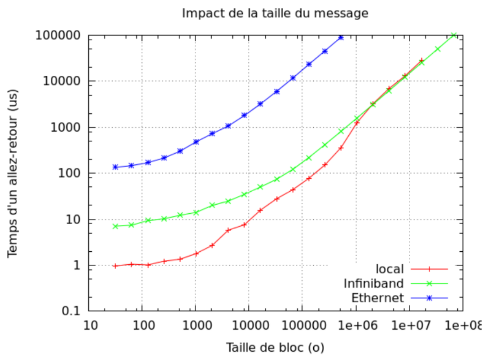

# Lab 5: MPI optimizations

## Generalities

1. Give the definition of network latency.

2. Give the definition of network bandwidth.

3. Give their respective units.

4. Give the name and version of the MPI library you are using. Give the command used to retrieve this information.

5. To make sure your installation works, you can use the hostname command, which returns the name of the current
   process’s host:
   ```sh
   mpirun -np 2 hostname
   ```
   What happens when all processes are executed on the same host?


## Ping pong

### Set up

In this exercise, you will do performance measurements using the ping-pong benchmark to familiarize with MPI’s
characteristics communication times.
Start by writing a ping-pong between two MPI processes. Rank 0 will send a message, and rank 1 will receive it. Write
your code so that you can set the message size as a command-line argument.

1. The code hereafter is a simple ping from rank 0 to rank 1 (no answer). We have voluntarily added a `sleep(2)` in
   the rank 1′s code.
   ```c
   if (rank == 0) {
     t0 = MPI_Wtime();
     MPI_Send(buffer, size, MPI_CHAR, 1, 0, MPI_COMM_WORLD);
     t1 = MPI_Wtime();
     printf("%lu\t%g\n", size, t1 - t0);
   } else if (rank == 1) {
     sleep(2);
     MPI_Recv(buffer, size, MPI_CHAR, 0, 0, MPI_COMM_WORLD, MPI_STATUS_IGNORE);
   }
   ```
   Using OpenMPI 2.0.1, we measured the execution time as a function of message size. We obtain 53.1654 ms for a size
   of 4,000 Bytes, and 2.0006 s for a size of 4,096 Bytes.
   How do you explain this difference? What did we actually measure?

2. Find the message size for which this gap appears in your MPI implementation. This size might be different than the
   one we observed using OpenMPI 2.0.1 (4,096 B). Explain the reason why.

3. We decide to remove the call to sleep() . Does the measure make sense now? Why?

4. Propose an alternative to measure the actual sending time of a message (i.e. the time it took to actually receive it
   on the target rank). Write the corresponding program.
    It is strongly advised that you read the MPI documentation of the different modes of communications: Standard,
    Buffered, Ready, Synchronous, etc.

5. Write an actual MPI ping-pong (rank 1 answers back to rank 0). Explain why the measured times corresponds to a
   message exchange.

### First measures

1. Do multiple measures with multiples of 32 Bytes for the message sizes. What do you see?

2. We propose adding a barrier before the message exchange phase. Explain what is the interest of this barrier with
   regards to the accuracy of the measurements.

3. Rerun the measures of question 11. Are the changes from the previous question sufficient? Why?

### Repetitions

When taking a measurement, it is important to remember that our environment does not allow us to reproduce the exact
conditions between each run. Moreover, time measurement itself is fraught with uncertainty. To solve this problem, we
prefer to repeat measurements and calculate an average (mean, think about which one is the best) and a median.
Alternatively, we can repeat runs until, e.g., the 95% confidence interval is within 5% of our reported means.

1. Update the program to add repetitions. You should now print the average execution time.

### Impact of message size

<figure markdown="span">
  
  <figcaption>Fig. 1 - Communication time as a function of message size</figcaption>
</figure>

Fig. 1 shows the evolution of ping-pong time according to message size between intra-node (local) and inter-node
(Ethernet and Infiniband) exchanges. Scales are logarithmic.

1. Explain why there is such a big gap between local and Infiniband for small sizes.
   Explain this gap shrinks progressively once the message size increases.

2. From the previous results, should we send distinct sets of data separately? Or should we try to group them together
   Is it true for all sizes?


## Collectives and algorithms in OpenMPI

Using a recent version of OpenMPI (4.0.5+), run the command `ompi_info -all`. This gives you multiple informations
about your installation. We will use to know which algorithms are available in the `coll tuned` module of OpenMPI,
where blocking collectives are implemented.

1. Find what are the usable algorithms for the `MPI_Bcast` routine. Compare their performance depending on the number of
   MPI processes and buffer size.

2. Find what are the usable algorithms for the `MPI_Gather` routine. Compare their performance depending on the number
   of MPI processes and buffer size.

3. Find what are the usable algorithms for the `MPI_Reduce` routine. Compare their performance depending on the number
   of MPI processes and buffer size.

4. Find what are the usable algorithms for the `MPI_Alltoall` routine. Compare their performance depending on the
   number of MPI processes and buffer size.

5. For each collective, why do we need multiple algorithms?


## Experimental evaluation of scalability

Let’s start with a very simple benchmark. Our MPI program will initially make no communication. Have node 0 measure the
program’s execution time. It will perform a simple sum of two vectors, in the following form:
$$
X_i^{t+1} = X_i^t + c
$$
with $X$ a vector of size $N$ and $c$ a real constant.

Clearly, such an equation can be distributed over several MPI processes without any communication, so we will simply
implement the sum method and execute it in a loop to obtain a suitable execution time for our measurement.

1. Implement this benchmark like so:
  - Initialize the MPI context
  - Pass the vector size and the number of repetitions as parameters of the program
  - Allocate and initialize memory for two vectors. Each node shall compute the sum on a vector of size $\frac{N}{nb_{tasks}$
  - Make sure to measure the execution time as seen previously in this lab

2. What does strong scalability represent?

3. What does weak scalability represent?

4. To introduce communications in our program, we want to consider a case inspired by finite elements method (FEM).
   Our equation is now:
   $$
   X_i^{t+1} = \frac{X_{i-1}^𝑡 + 2 X_i^t + X_{i+1}^t}{4}
   $$
   Here, MPI slicing requires the addition of communications for border elements. Modify the application in this way
   and evaluate scalability.

5. Introduce a global synchronization in the repetitions loop and re-evalute the application’s scalability. What do you
   see? What remarks can you make about communications and the use of barriers in MPI applications? What should you do
   to avoid this problem?
