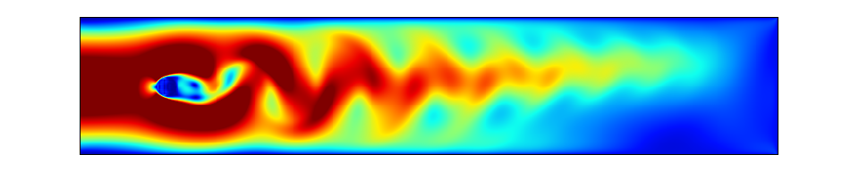
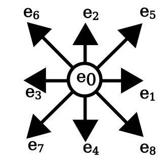
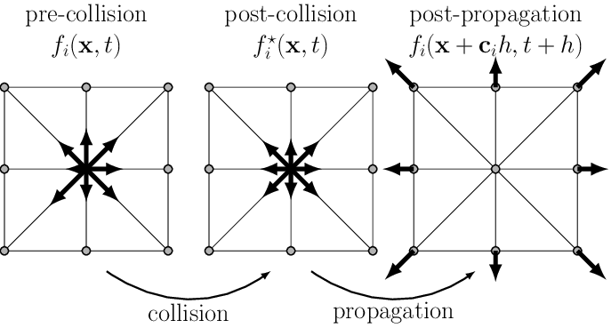
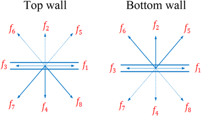
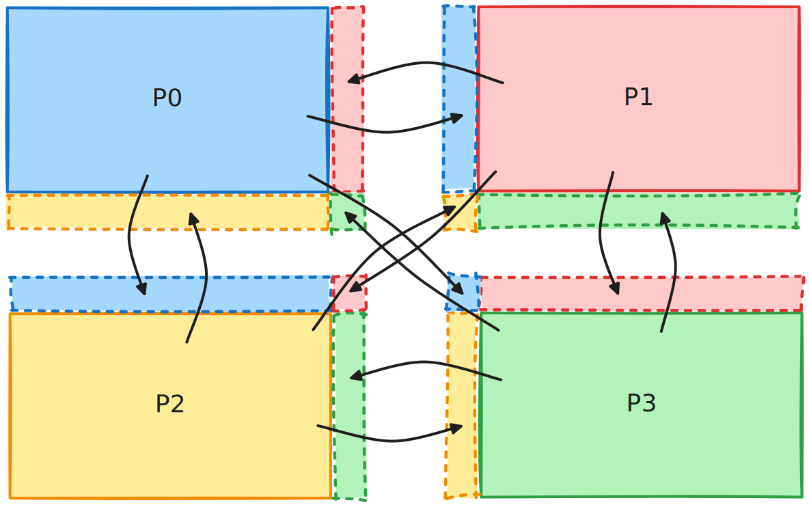

# Project

**Optimization of an hybrid parallel D2Q9 lattice Boltzmann solver for Kármán vortex street.**

<figure markdown="span">
  
</figure>


## Goals

You are tasked with optimizing a numerical simulation to make it as scalable as possible.

The provided code has been intentionally "de-optimized".
It’s up to you to use every tool at your disposal to identify and eliminate the various bottlenecks in this program.
A performant hybrid MPI+OpenMP implementation is expected.
You are free to port the provided code to other programming models (e.g., Kokkos, RAJA, SYCL for shared-memory parallelism; or SHMEM for distributed communications).
Ultimately, make the code as fast as possible, so long as it produces the same results as the baseline.

This project is to be done in pairs.


## Submission

### Report

You will submit a succinct and synthetic PDF report presenting your work (max. 10 pages, title page, TOC and appendix excluded; in French or English, at your convenience; preferably typeset in Typst or LaTeX).

It should include any attempts (successful or otherwise) to identify performance bottlenecks, as well as the impact these fixes had on performance.
If a change does not yield the desired results, feel free to mention it and be critical of your work; this is just as valuable.

At each step of your optimization process, you should:

1. Use a tool to identify a bottleneck
2. Propose and implement an optimization to fix the issue
3. Assess the performance impact of the optimization

Rely on debugging and profiling tools as much as possible, and demonstrate performance improvements with figures (charts, plots, tables, etc.).
Run scalability evaluations regularly to showcase the iterative improvements you have made.

!!! note

    The report should include a link to a properly-versioned Git repository with all your optimizations.

!!! note

    The report should include a section presenting the system configuration used to benchmark the simulation:

    - Hardware specifications: CPU (architecture, core count, frequency, SIMD ISAs, etc.), DRAM (capacity, frequency, etc.), interconnect (if running on a multi-node system)
    - Software configuration: compilers (versions, flags, ...), operating system (kernel version, page size, ...), libraries, tools, etc.

**Deadline**

The deadline for submitting the report is set to the 2026-04-28 at 23:59 CEST.
Send your report by email at [gabriel.dossantos@cea.fr](mailto:gabriel.dossantos@cea.fr) and [hugo.taboada@cea.fr](mailto:hugo.taboada@cea.fr).

Any report submitted past the deadline will be dismissed and therefore receive a 0/20.

### Oral presentation

You will also prepare a 20 min oral project defense (12 min presentation, 8 min questions) that will be held on the 2026-05-05 (date to be confirmed).
Your presentation should be an exhaustive summary of your report.

!!! danger

    **The oral defense is a high-stakes academic exercise.**

    HPCS M.Sc. students are expected to present a rigorously structured slide deck and deliver a thoroughly prepared defense before the jury.
    This is not a formality, the course instructor and TA will critically assess both the depth of your technical understanding, and the clarity of your scientific communication.
    Superficial preparation is not acceptable at this level.
    You are expected to demonstrate mastery of the parallel optimization techniques, stategies, and performance analysis underlying your implementation.   
    Treat this defense with the seriousness it demands.


## Context

### Generalities

The provided code simulates a Kármán vortex street flow.
In fluid dynamics, a Kármán vortex street is a repeating pattern of swirling vortices, caused by a process known as vortex shedding, which is responsible for the unsteady separation of flow of a fluid around blunt bodies.
This phenomenon can be observed in nature, for example when wind flows around islands or isolated mountain peaks.
Historically, this has also been used in studies of airflow around aircraft or buildings.

In our case, we will consider a fluid flowing through a 2D tube in which a round obstacle is placed.
This is essentially equivalent to simulating a wind tunnel.
For the solver, we use the lattice Boltzmann method (LBM). 

The following references can help to better understand the details of the mathematical resolution:

- [General description](https://cims.nyu.edu/billbao/report930.pdf)
- [Alexandre Dupuis' PhD thesis, chap. 3](https://cui.unige.ch/chopard/CA/aDupuisPhD.pdf)
- Implementation examples: [[1](https://wiki.palabos.org)], [[2](https://cims.nyu.edu/billbao/courses.html)]

### D2Q9 LBM scheme

As explained in the aforementioned documents, LBM models the fluid by spatially discretizing it on a Cartesian grid.
Within the grid cells, the fluid is broken down at the microscopic level into fluid particles that can move in 9 directions.
This is known as the D2Q9 model (2 dimensions, 9 directions/speeds), see figure 1 below.

<figure markdown="span">
  
  <figcaption>Figure 1: A cell of the 2D mesh and its 9 directions</figcaption>
</figure>

Each cell carries the following physical quantities:

- The microscopic densities of the fluid (probability) moving in the associated direction: $f_1$, $f_2$, $f_3$, $f_4$, $f_5$, $f_6$, $f_7$, $f_8$, $f_9$
- The macroscopic density at the considered position, obtained by summing the nine microscopic densities:

$$
\rho (\overrightarrow{x}, t) = \sum_{i=1}^{9} f_i (\overrightarrow{x}, t)
$$

- The macroscopic velocity of the fluid, constructed from a sum of the microscopic densities:

$$
v (\overrightarrow{x}, t) = \frac{1}{\rho} \sum_{i=1}^{9} c f_i (\overrightarrow{x}, t) \overrightarrow{e}_i
$$

When visualizing the simulation, we will particularly focus on the norm of the macroscopic velocity.


## Simulation implementation

### High-level algorithm

At each time step of the simulation, we need to:

1. Apply the particular conditions (boundary condition, obstacle, etc.)
2. Compute the collisions on the fluid's particles at the microscopic level
3. Propagate (stream) the values on each direction

<figure markdown="span">
  
  <figcaption>Figure 2: Collision and streaming steps toward neighboring cells</figcaption>
</figure>

### Microscopic collisions

For each fluid cell, at each time step, we need to update the collisions between fluid particles moving in different directions:

1. Compute the macroscopic quantities: density ($\rho$) and velocity ($v$)
2. Use the previous calculation and the $f_i$ values to evaluate the collisions between the 9 fluid particles located at the same position
3. Compute the derivative of the Navier-Stokes equation (math details fall outside the scope of this course), given by the following formula:

$$
f_i = f_i^{*} - \frac{1}{\tau} (f_i^{*} - f_{eq})
$$

   where:

   - $f_i$ is the new state
   - $f_i^{*}$ is the unstable state obtained after step (1)
   - $f_{eq}$ is the equilibrium state toward which the fluid will tend, as given in step (1).
     Note that the implementation strategy makes the equation dimensionless by using the Reynolds number; therefore, the velocity constant $c$ does not appear in it, as it is absorbed by this last term
   - $\frac{1}{\tau}$ epresents the characteristic time it takes for the fluid to reach equilibrium.
     This value depends on the fluid's viscosity.

The weights $w_i$ are used to compensate for the fact that the 9 vectors $\overrightarrow{e}_i$ (figure 1) do not all have the same norm.
The values of these weights are given in (1).

### Left boundary conditions

The left boundary is the fluid's entry point; we therefore consider a steady-state condition with a flow velocity that follows a Poiseuille distribution (the solution for flow in a tube).
Roughly speaking, this function yields a velocity profile that is zero at the boundaries (due to wall friction) and maximum at the center.

To maintain fluid equilibrium, this flow is introduced using the You/Le method.
Specifically, this involves obtaining flow conditions consistent with the constant velocity condition imposed externally and the current state of the fluid portion in contact with the boundary.

### Right boundary conditions

The same principle applies to You/Le, but instead of maintaining a velocity profile, the goal is to maintain a zero-density gradient.
In other words, the condition is that the same amount of fluid must pass through the wall (i.e., exit the tube) as must arrive at the wall, while maintaining a non-zero pressure at the end.

### Top and bottom boundary conditions

These boundaries represent walls, so we apply a simple reflection, just as we would with a photon hitting a mirror or a particle hitting a plate.
Friction against the wall also causes the velocity to be zero along its surface.

<figure markdown="span">
  
  <figcaption>Figure 3: Top and bottom boundary conditions</figcaption>
</figure>

### Obstacle conditions

The obstacle behaves like a wall; the same method is used as for the top and bottom boundaries.

### Initial state

The initial condition is assumed to be a steady laminar flow, and thus follows a Poiseuille velocity profile throughout the fluid.
The density is set to a constant value of 1 for all nodes.
At time $t_0$, the obstacle is introduced.
The artifact observed during the first few time steps is related to this abrupt introduction.

### Communication scheme

In MPI mode, the mesh is partitioned into subdomains so that the work is distributed across each node.
In our case, at each time step, we need to obtain updates for the ghost cells bordering the local domain.

<figure markdown="span">
  
  <figcaption>Figure 4: Halo exchange communication scheme for 4 MPI processes</figcaption>
</figure>


## Code

The baseline code is available [here](https://github.com/dssgabriel/TOP-26/tree/main/project).

### Requirements

**Simulation:**

- C++ compiler
- CMake 3.25+
- MPI implementation (conforming to MPI 3.0+ standard)
- OpenMP (conforming to OpenMP 4.0+ specification)

**Validation and visualization:**

- Python 3.10+
- [uv](https://github.com/astral-sh/uv)
- Gnuplot
- Compiled `top.display` binary

### Build & Run

**Simulation**

Build:
```bash
# Configure
cmake -B <BUILD_DIR>

# Compile
cmake --build <BUILD_DIR> -t top.lbm-exe
```

Run:
```bash
# Execute with 512 MPI processes
mpirun -np 512 ./<BUILD_DIR>/top.lbm-exe <CONFIG_FILE>
```

**Display helper program**

```bash
# Configure
cmake -B <BUILD_DIR>

# Compile
cmake --build <BUILD_DIR> -t top.display
```

### Configuration file

The simulation is configured using a simple `config.txt` text file in the following format:
```
iterations           = 20000
width                = 800
height               = 160
obstacle_x           = 100.0
obstacle_y           = 80.0
obstacle_r           = 11.0
reynolds             = 100
inflow_max_velocity  = 0.18
output_filename      = results.raw
write_interval       = 100
```

The parameters are:

| Parameter | Description |
| --- | --- |
| `iterations` | Number of time steps |
| `width` | Total width of the mesh |
| `height` | Total height of the mesh |
| `obstacle_x` | X-axis position of the obstacle |
| `obstacle_y` | Y-axis position of the obstacle |
| `obstacle_r` | Radius of the obstacle |
| `reynolds` | Ratio of inertial to viscous forces governing the laminar to turbulent transition regime of the flow |
| `inflow_max_velocity` | Maximum inlet flow velocity |
| `output_filename` | Path of the output `.raw` file (no write if undefined) |
| `write_interval` | Number of time step between writes to the output file |


### Validate & Visualize

An `lbm-viz` tool is provided to help you validate and visualize LBM simulation results as GIFs.

**Local installation**

```bash
uv pip install -e .
```

**Usage**

Compare two files (verify checksums):
```bash
lbm-viz --check ref_results.raw <INPUT>.raw
```
_Run this regularly to validate that your changes don't affect the results of the simulation!_

Generate GIF from `.raw` file:
```bash
lbm-viz --generate-gif <INPUT>.raw <OUTPUT>.gif
```

Extract frames as PNG:
```bash
# Defaults to extracting the last frame
lbm-viz --png <INPUT>.raw <OUTPUT>.png

# Extract specific frame as PNG
lbm-viz --png <INPUT>.raw <OUTPUT>.png --frame 0
```

**Options**

| Option | Description | Default |
|--------|-------------|---------|
| `--generate-gif INPUT OUTPUT` | Generate GIF from .raw file | - |
| `--png INPUT OUTPUT` | Extract frame as PNG | - |
| `--check REFERENCE INPUT` | Compare INPUT against REFERENCE | - |
| `--frame N` | Frame index for PNG (0-indexed) | Last frame |
| `-j, --workers N` | Number of parallel workers | Physical cores - 1 |
| `-d, --delay N` | GIF frame delay (centiseconds) | 5 |
| `-s WIDTH HEIGHT` | Output dimensions for GIF | Auto (mesh × 1.8) |
| `--cbr MIN MAX` | Colorbar range | 0.0 - 0.14 |
| `--display-bin-path` | Path to display binary | `./build/top.display` |

**Development**

To run directly without installing locally:
```bash
uv run python -m lbm_viz --generate-gif results.raw test.gif
```
